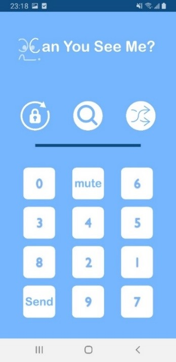

- 랜덤 배열 및 Dual interface를 활용한 투명 도어락
(2019.12 ~ 2020.03)
    - 붙이는 투명 키패드와 App이 Bluetooth로 연동된 Door Lock
    - 핵심 기능을 모듈화하여 웹 로그인, ATM 등 다양한 인증 장치에
    사용 가능하도록 추가 개발 진행
    - **App 개발 및 전체 서비스 Flow 구성 담당 (팀장)**
    - **Issue**
        1. 사용자가 터치한 키패드 위치를 App화면상 키패드 번호와 매칭하는 로직 구현
        2. 터치된 키패드 위치 전송시, 정보 변경 방지 로직 구현
        3. 안드로이드 버전에 따른 블루투스 보안 정책으로 인한 기능 제한 Issue
    - **Issue 해결**
        1. Static 파일 이름과 변수 이름을 매핑해 로직 구현
        2. 입력 위치 문자열 앞뒤로 Check bit 1비트씩 추가하여 에러 검출
        3. 안드로이드 버전 6.0부터 위치 권한까지 받아야 블루투스 기능 사용 가능
        - 버전 체크 후 필요한 권한 요청

